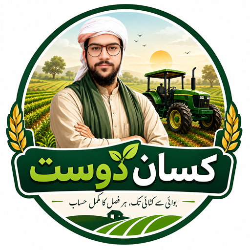

<div align="center">

  

  # کسان دوست — Kisan Dost
  ### آپ کا ڈیجیٹل زرعی روزنامچہ
  **A Smart, Offline-First Digital Farm Management Diary Tailored for Farmers**

  [](https://flutter.dev)
  [](https://dart.dev)
  [](https://sqlite.org)
  [](https://android.com)
  [-673AB7?style=for-the-badge)](#)
  [](#)

</div>

---

## 🌾 About Kisan Dost (ایپ کے بارے میں)

**کسان دوست (Kisan Dost)** is a comprehensive, offline-first mobile application built with Flutter to empower farmers with seamless agricultural record-keeping and business analytics. 

Designed specifically with native **Urdu typography (Jameel Noori Nastaleeq)** and an intuitive **Right-to-Left (RTL)** layout, Kisan Dost eliminates the complexities of manual paper diaries. From crop sowing to harvest sales, financial profit & loss calculations, and Islamic Ushr computations, Kisan Dost helps farmers track every rupee and every acre—without requiring an active internet connection.

---

## ✨ Key Features (اہم خصوصیات)

| Feature | Description |
| :--- | :--- |
| 🏡 **Farm Management (میرے فارمز)** | Register and organize multiple farms, plots, and total acreages. |
| 🌱 **Crop Lifecycle (میری فصلیں)** | Monitor sowing dates, seed varieties, expected harvest periods, and growth status. |
| 📝 **Activity Logging (زرعی سرگرمیاں)** | Log irrigation, plowing, pesticide spraying, fertilizer application, and manual labor. |
| 💰 **Expense Tracking (اخراجات کا حساب)** | Categorized expense bookkeeping for diesel, seeds, chemical fertilizers, equipment, and wages. |
| 🚜 **Harvest & Sales (پیداوار اور فروخت)** | Track harvest yields (maunds/kg), sale prices, buyers, market (Mandi) commissions, and receipts. |
| 📊 **Profit & Loss Analysis (منافع و نقصان)** | Automatic calculation of net income per crop season and per farm plot with clear financial summaries. |
| 📜 **Theka Management (ٹھیکہ کا انتظام)** | Full management of leased agricultural land: contract dates, lease costs, installment payment schedules, and balances. |
| 🤲 **Ushr Calculator (عشر کیلکولیٹر)** | Built-in Islamic agricultural tithe calculator supporting 10% (barani/rain-fed) and 5% (canal/tubewell) rules with allowable cost deductions. |
| 📦 **Warehouse & Inventory (اسٹاک اور گودام)** | Keep track of remaining fertilizers, seeds, and pesticide inventory with consumption alerts. |
| ⏰ **Agricultural Alarms & Tasks (یاد دہانیاں اور الارم)** | Schedule field tasks and set custom full-screen alarm reminders for critical irrigation and spray intervals. |
| 📄 **PDF Reports & Invoicing (پی ڈی ایف رپورٹس)** | Generate and print downloadable PDF statements for farm accounts, sales, and expenses. |
| 🌐 **100% Offline-First (بغیر انٹرنیٹ کے)** | All data is stored securely on device via SQLite. Zero internet or account signup required. |

---

## 🛠️ Technology Stack

- **Framework:** [Flutter](https://flutter.dev/) (Material 3 UI, RTL support)
- **Programming Language:** [Dart](https://dart.dev/)
- **Database:** Local [SQLite](https://pub.dev/packages/sqflite) (`sqflite`, `path_provider`)
- **State Management:** [Provider](https://pub.dev/packages/provider) Pattern
- **Notifications & Scheduling:** `flutter_local_notifications` & `timezone`
- **Document Generation:** `pdf` & `printing`
- **Animations & Assets:** [Lottie Flutter](https://pub.dev/packages/lottie)
- **Typography:** Custom embedded *Jameel Noori Nastaleeq* font

---

## 📁 Project Architecture

```text
kisan_dost/
├── assets/
│   ├── fonts/               # Jameel Noori Nastaleeq font
│   ├── images/              # App branding, icons, and illustrations
│   └── lottie/              # Micro-animations
├── lib/
│   ├── database/            # SQLite database helper & table schemas
│   ├── models/              # Data models (Farm, Crop, Expense, Harvest, Theka, Task, etc.)
│   ├── providers/           # ChangeNotifier state providers (business logic)
│   ├── screens/             # UI screens (Dashboard, Expenses, Harvest, Theka, Ushr, etc.)
│   ├── services/            # Local notification & alarm services
│   ├── theme/               # Colors, typography, and themes
│   ├── widgets/             # Reusable UI components
│   └── main.dart            # Application entry point & provider tree
└── pubspec.yaml             # Dependencies and configuration
```

---

## 🚀 Getting Started

### Prerequisites

Ensure you have the following installed on your development workstation:
- [Flutter SDK](https://docs.flutter.dev/get-started/install) (version `>= 3.7.2`)
- [Android Studio](https://developer.android.com/studio) or [VS Code](https://code.visualstudio.com/) with Flutter extension
- Android Device or Emulator running API Level 21+

### Installation & Run

1. **Clone the repository:**
   ```bash
   git clone https://github.com/TalhaGoharWeb/KisanDost.git
   cd KisanDost
   ```

2. **Install dependencies:**
   ```bash
   flutter pub get
   ```

3. **Run on a connected device:**
   ```bash
   flutter run
   ```

4. **Build APK for production:**
   ```bash
   flutter build apk --release
   ```
   The APK will be generated at `build/app/outputs/flutter-apk/app-release.apk`.

---

## 👨‍💻 Developer & Credits

- **Developer:** Muhammad Talha Farid Farooqi ([TalhaGoharWeb](https://github.com/TalhaGoharWeb))
- **Email:** malikimadhaburdu@gmail.com
- **Mission:** Dedicated to empowering farmers across Pakistan with intuitive, modern, and accessible digital tools.

---

## 📄 License

This project is released for the benefit and support of the farming community. Feel free to contribute or report suggestions via GitHub Issues.
